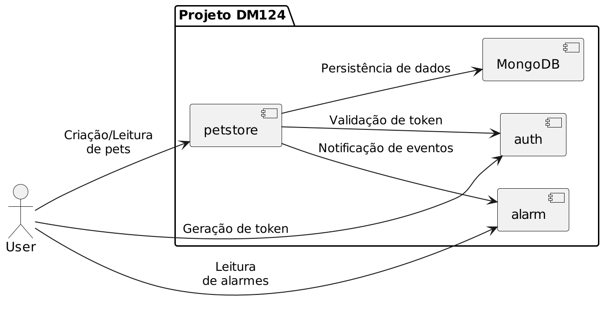

# DM124 - Arquitetura de Microserviços com Segurança em Node.js

[](https://nodejs.org/)
[](https://expressjs.com/)
[](https://www.mongodb.com/)
[](https://www.docker.com/)

## 📋 Visão Geral

Projeto de referência da disciplina **DM124 - Desenvolvimento de Web Services com Segurança sob plataforma Node.js**.

Um exemplo didático completo de arquitetura de microserviços com autenticação JWT, comunicação inter-serviços e monitoramento com sistema de alarmes. O projeto demonstra boas práticas em desenvolvimento de aplicações seguras e escaláveis com Node.js.

### Características Principais

- ✅ **Autenticação JWT**: Token exchange e validação entre serviços
- ✅ **Microserviços Independentes**: Três serviços especializados comunicando-se via HTTP
- ✅ **Persistência de Dados**: Integração com MongoDB
- ✅ **Monitoramento em Tempo Real**: Sistema de alarmes para detecção de eventos
- ✅ **Containerização**: Docker Compose para orquestração
- ✅ **Desenvolvimento Facilitado**: Nodemon para reload automático

---

## 🏗️ Arquitetura



### Serviços da Arquitetura

| Serviço | Porta | Responsabilidade |
|---------|-------|-----------------|
| **Auth** | 3001 | Autenticação JWT e validação de tokens |
| **Petstore** | 3000 | Gerenciamento de entidades Pet |
| **Monitor** | 3002 | Monitoramento e sistema de alarmes |
| **MongoDB** | 27017 | Armazenamento de dados |

---

## 🚀 Quick Start

### Pré-requisitos

- **Node.js** 18+ ([download](https://nodejs.org/))
- **npm** 9+ (incluído no Node.js)
- **MongoDB** ([local](https://docs.mongodb.com/manual/installation/) ou [Atlas](https://www.mongodb.com/cloud/atlas))
- **Docker** e **Docker Compose** (opcional, para containerização)

### Instalação Local

#### 1. Clone o Repositório

```bash
git clone <repository-url>
cd DM124-ProjetoReferencia
```

#### 2. Configure as Variáveis de Ambiente

Crie os arquivos `.env` em cada serviço:

**`auth/.env`**
```env
PORT=3001
NODE_ENV=dev
CHAVE_PRIVADA=sua_chave_privada_segura_aqui
TEMPO_EXP=1h
```

**`petstore/.env`**
```env
PORT=3000
NODE_ENV=dev
MONGODB_HOST=localhost
MONGODB_PORT=27017
MONGODB_DBNAME=petstore_db
AUTH_SERVER=http://localhost:3001
MONITOR_SERVER=http://localhost:3002
```

**`monitor/.env`**
```env
PORT=3002
NODE_ENV=dev
```

#### 3. Instale as Dependências e Inicie os Serviços

Em **três terminais separados**, execute:

**Terminal 1 - Serviço Auth**
```bash
cd auth
npm install
npm run dev
```

**Terminal 2 - Serviço Petstore**
```bash
cd petstore
npm install
npm run dev
```

**Terminal 3 - Serviço Monitor**
```bash
cd monitor
npm install
npm run dev
```

✅ Todos os serviços estarão rodando. Você verá mensagens de log indicando que estão prontos para receber requisições.

---

## 🐳 Execução com Docker Compose

### Iniciar Todos os Serviços

```bash
docker compose up --build
```

Isto irá:
- Construir as imagens Docker de cada serviço
- Criar a rede de comunicação entre contêineres
- Iniciar MongoDB, Auth, Petstore e Monitor

Para parar os serviços:
```bash
docker compose down
```

### Testando Falha de Conectividade

Para simular a falha de MongoDB e testar o sistema de alarmes:

```bash
docker stop dm124-mongo
```

Isso acionará os alarmes de indisponibilidade do banco de dados. Para reiniciar:

```bash
docker start dm124-mongo
```

---

## 📡 API Endpoints

### 🔐 Serviço de Autenticação (Auth)

**Base URL**: `http://localhost:3001`

#### Login
```http
POST /auth/login
Content-Type: application/json

{
  "usuario": "seu_usuario",
  "senha": "sua_senha"
}
```

**Resposta de Sucesso (200)**
```json
{
  "token": "eyJhbGciOiJIUzI1NiIsInR5cCI6IkpXVCJ9..."
}
```

#### Validar Token
```http
POST /auth/validaToken
Content-Type: application/json

{
  "token": "seu_token_jwt"
}
```

**Resposta de Sucesso (200)**
```json
{
  "valido": true,
  "usuario": "seu_usuario"
}
```

---

### 🐾 Serviço de Petstore

**Base URL**: `http://localhost:3000`

**Autenticação**: Todas as rotas requerem o header `Authorization: Bearer <token>`

#### Criar Pet
```http
POST /pet
Authorization: Bearer <seu_token>
Content-Type: application/json

{
  "nome": "Rex",
  "raca": "Golden Retriever",
  "idade": 3
}
```

**Resposta (201)**
```json
{
  "_id": "507f1f77bcf86cd799439011",
  "nome": "Rex",
  "raca": "Golden Retriever",
  "idade": 3
}
```

#### Listar Todos os Pets
```http
GET /pet
Authorization: Bearer <seu_token>
```

**Resposta (200)**
```json
[
  {
    "_id": "507f1f77bcf86cd799439011",
    "nome": "Rex",
    "raca": "Golden Retriever",
    "idade": 3
  }
]
```

#### Buscar Pet por Nome
```http
GET /pet?nome=Rex
Authorization: Bearer <seu_token>
```

**Resposta (200)**
```json
[
  {
    "_id": "507f1f77bcf86cd799439011",
    "nome": "Rex",
    "raca": "Golden Retriever",
    "idade": 3
  }
]
```

---

### 🚨 Serviço de Monitoramento (Alarmes)

**Base URL**: `http://localhost:3002`

#### Listar Todos os Alarmes
```http
GET /alarme
```

**Resposta (200)**
```json
[
  {
    "id": "MONGO_INDISPONIVEL",
    "descricao": "MongoDB está indisponível",
    "ativo": false,
    "ativacoes": ["2025-12-21T10:30:00Z"]
  }
]
```

#### Filtrar Alarmes por Status
```http
GET /alarme?ativo=true
```

#### Ativar Alarme
```http
POST /alarme/{id}/ativar
```

**Resposta (200)**
```json
{
  "id": "MONGO_INDISPONIVEL",
  "ativo": true
}
```

#### Desativar Alarme
```http
POST /alarme/{id}/desativar
```

**Resposta (200)**
```json
{
  "id": "MONGO_INDISPONIVEL",
  "ativo": false
}
```

---

## 🧪 Testando com Postman

Uma coleção completa está disponível no arquivo `DM124.postman_collection.json`.

### Como Importar

1. Abra o Postman
2. Clique em **Import** (Ctrl+O)
3. Selecione o arquivo `DM124.postman_collection.json`
4. Ajuste as variáveis de ambiente conforme necessário

---

## 📁 Estrutura do Projeto

```
DM124-ProjetoReferencia/
├── auth/                          # Serviço de Autenticação
│   ├── Dockerfile
│   ├── index.js                   # Entrada da aplicação
│   ├── routes.js                  # Definição de rotas
│   ├── package.json
│   └── src/
│       └── controllers/
│           └── AuthController.js  # Lógica de autenticação
│
├── petstore/                      # Serviço de Gerenciamento de Pets
│   ├── Dockerfile
│   ├── index.js
│   ├── routes.js
│   ├── package.json
│   └── src/
│       ├── controllers/
│       │   ├── AuthController.js  # Validação de tokens
│       │   └── PetController.js   # Lógica de negócio
│       ├── database/
│       │   └── config.js          # Configuração MongoDB
│       ├── models/
│       │   └── Pet.js             # Schema do Mongoose
│       └── service/
│           └── AlarmeService.js   # Integração com Monitor
│
├── monitor/                       # Serviço de Monitoramento
│   ├── Dockerfile
│   ├── index.js
│   ├── routes.js
│   ├── package.json
│   └── src/
│       └── controllers/
│           └── AlarmeController.js # Gerenciamento de alarmes
│
├── docs/
│   ├── diagram/
│   │   └── deployment.puml        # Diagrama da arquitetura
│   └── img/
│       └── deployment.png
│
├── docker-compose.yaml            # Orquestração de contêineres
├── DM124.postman_collection.json  # Coleção Postman
├── func.js                        # Funções utilitárias
├── async.js                       # Helpers de assincronismo
└── README.md                      # Este arquivo
```

---

## 🔧 Dependências Principais

### Todos os Serviços
- **express** (4.18+): Framework web
- **dotenv** (16.3+): Gerenciamento de variáveis de ambiente
- **morgan** (1.10+): Logger HTTP
- **nodemon** (dev): Reload automático em desenvolvimento

### Auth
- **jsonwebtoken** (9.0+): Criação e validação de JWT

### Petstore
- **mongoose** (8.0+): ODM para MongoDB
- **axios** (1.6+): Cliente HTTP para comunicação inter-serviços

---

## 🔐 Fluxo de Autenticação

```
1. Cliente faz requisição POST /auth/login (usuario + senha)
   ↓
2. Serviço Auth valida credenciais e gera JWT
   ↓
3. Cliente recebe token e armazena
   ↓
4. Cliente inclui token em header: Authorization: Bearer <token>
   ↓
5. Serviço Petstore valida token chamando Auth /auth/validaToken
   ↓
6. Se válido, operação é executada
   Se inválido, retorna 401 Unauthorized
```

---

## 📊 Sistema de Alarmes

O serviço Monitor gerencia alarmes em tempo real. Alarmes podem ser:

- **MONGO_INDISPONIVEL**: Detectado quando conexão com MongoDB falha
- **AUTH_INDISPONIVEL**: Serviço de autenticação fora do ar
- **PETSTORE_ERRO**: Erros críticos no serviço Petstore

Cada alarme possui:
- `id`: Identificador único
- `descricao`: Descrição legível
- `ativo`: Status atual (true/false)
- `ativacoes`: Histórico de timestamps quando foi acionado

---

## 🛠️ Desenvolvimento

### Adicionando um Novo Endpoint

1. **Defina a rota** em `routes.js`:
```javascript
router.post('/novo', novoController.criar);
```

2. **Implemente a lógica** em `src/controllers/NovoController.js`

3. **Teste via Postman** ou cURL

### Executando com Hot Reload

Todos os serviços utilizam `nodemon`. Qualquer alteração em arquivo `.js` fará o serviço reiniciar automaticamente.

```bash
npm run dev
```

### Logs e Debugging

- **Morgan**: Logs HTTP detalhados
- **Console.log**: Use para debugging adicional
- **Docker logs**: `docker logs dm124-petstore`

---

## 🐛 Troubleshooting

### Erro de Conexão MongoDB
```
Error: connect ECONNREFUSED 127.0.0.1:27017
```
**Solução**: Verifique se MongoDB está rodando e acessível na URL configurada.

### Token Inválido/Expirado
```
Status: 401 Unauthorized
```
**Solução**: Gere um novo token via `/auth/login` e inclua em todos os headers.

### Porta Já em Uso
```
Error: listen EADDRINUSE :::3000
```
**Solução**: Altere a `PORT` no `.env` ou mate o processo existente.

### Serviços não Comunicam
**Solução**: Verifique URLs em `AUTH_SERVER` e `MONITOR_SERVER`. Use `docker network ls` para verificar conectividade.

---

## 📚 Recursos Adicionais

- [Express.js Documentation](https://expressjs.com/)
- [MongoDB Manual](https://docs.mongodb.com/manual/)
- [JWT Introduction](https://jwt.io/introduction)
- [Docker Compose Reference](https://docs.docker.com/compose/)
- [Mongoose Documentation](https://mongoosejs.com/)

---

## 👨‍🏫 Sobre

Projeto desenvolvido como material de referência para a disciplina **DM124 - Desenvolvimento de Web Services com Segurança** usando Node.js e arquitetura de microserviços.

**Última Atualização**: Dezembro de 2025

Com o serviço do MongoDB parado você verá este log no serviço **Petstore**:

```log
dm124-petstore  | [ATIVAR ALARME] - DB down
dm124-petstore  | Alarme alterado: {"id":"DB_0001","descricao":"MongoDB fora do ar.","ativo":true,"ativacoes":["2025-05-26T15:29:42.363Z"]}
```

Durante o tempo que o serviço do MongoDB estiver fora do ar, qualquer request para o serviço Petstore retornará `503 Service Unavailable` com o seguinte payload:

```json
{
    "msg": "MongoDB fora do ar."
}
```

Novamente inicie o serviço do MongoDB com o comando abaixo:

```shell
docker start dm124-mongo
```

Com o serviço do MongoDB parado você verá este log no serviço **Petstore**:

```log
dm124-petstore  | [DESATIVAR ALARME] - DB up
dm124-petstore  | Alarme alterado: {"id":"DB_0001","descricao":"MongoDB fora do ar.","ativo":false,"ativacoes":[]}
```